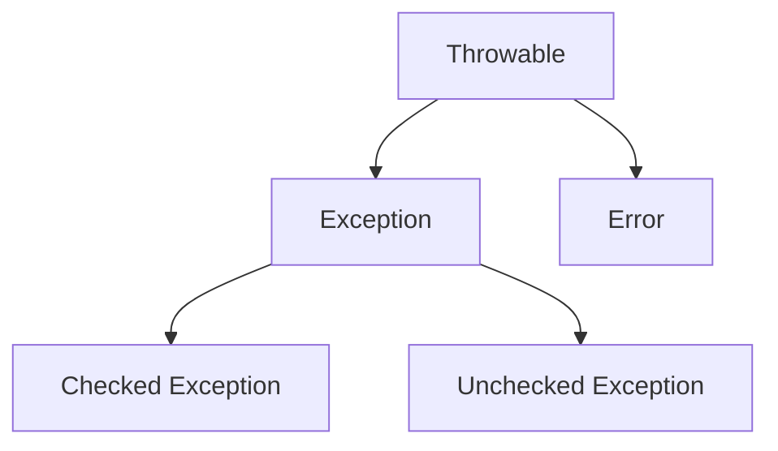

# Java Notes

[TOC]

## Process

+ [x] Java程序基础
+ [x] 流程控制
+ [x] 数组操作
+ [x] 面向对象基础
+ [x] Java核心类
+ [x] 集合
+ [ ] 泛型
  + [ ] 泛型和反射

+ [ ] 单元测试
  + [ ] 异常测试


## Basic

+ 一个Java源码只能定义**一个**`public`类型的class，并且class名称和文件名要完全一致；

+ ```java
  // 单行注释
  
  /*
  多行
  注释
  */
  
  /**
  *用于自动创建文档的
  *特殊多行注释
  */
  ```

+ 使用`javac`可以将`.java`源码编译成`.class`字节码;

  使用`java`可以运行一个已编译的Java程序，参数是类名。

+ switch 语法

  ```java
  switch (整型/字符串/枚举) {
    case "apple":
      System.out.println("selected apple");
      break;
    case "mango":
      System.out.println("selected mango");
      break;
    default:
      System.out.println("no fruit selected");
      break;
  }
  ```

+ 三元运算符`b ? x : y`，它根据第一个布尔表达式的结果，分别返回后续两个表达式之一的计算结果。

+ `import`

  + `import org.example.*`会导入改包下的所有class，但不会引入子包的class。

  + `import static`可以引入一个类的**静态字段**和**静态方法**。
  
+ 在开发阶段，多个版本的JDK可以同时安装，当前使用的JDK版本可由`JAVA_HOME`环境变量切换。

+ classpath: JVM搜索class的路径集合，设置classpath: `java -classpath(-cp) . abc.xyz.Hello `

+ jar包

  + 压缩文件，可以包含很多`.class`文件，方便下载和使用。
  + `MANIFEST.MF`文件可以提供jar包的信息，如`Main-Class`，这样可以直接运行jar包。
  + 运行包含主类的jar包，`java -jar hello.jar`
  

### 数据类型

+ 二进制`0b1111`，十六进制`0xf`。

+ `\u####` 转义字符表示一个Unicode编码的字符

+ 对于`float`类型，需要加上`f`后缀; long类型需要加上`l`后缀。

+ 强制转型使用`(类型) 变量`。

  ```java
  double d = 3.14;
  int i = (int) d; // 将 double 类型的 d 转换为 int 类型
  System.out.println(i); // 输出: 3
  ```

  

+ 定义变量的时候，如果加上`final`修饰符，这个变量就变成了常量。常量在定义时进行初始化后就不可再次赋值，再次赋值会导致编译错误。

+ Java的`String`和`char`在内存中总是以Unicode编码表示，要显示一个字符的Unicode编码，只需将`char`类型直接赋值给`int`类型即可：

  ```java
  int n1 = 'A'; // 字母“A”的Unicodde编码是65
  ```


### Integer包装类

+ 创建`Integer`实例

  ```java
  int i = 100;
  // 通过new操作符创建Integer实例(不推荐使用,会有编译警告):
  Integer n1 = new Integer(i);
  // 通过静态方法valueOf(int)创建Integer实例:
  Integer n2 = Integer.valueOf(i);
  // 通过静态方法valueOf(String)创建Integer实例:
  Integer n3 = Integer.valueOf("100");
  ```

+ Auto Boxing，Java编译器可以帮助我们自动在`int`和`Integer`之间转型

  ```java
  // 装箱
  Integer n = 100; // 编译器自动使用Integer.valueOf(int)
  // 拆箱
  int x = n; // 编译器自动使用Integer.intValue()
  ```
  
+ **所有整型包装类对象之间值的比较，全部使用`equals`方法比较。**

  `Byte`,`Short`,`Integer`,`Long` 这 4 种包装类默认创建了数值 **[-128，127]** 的相应类型的缓存对象，`Character` 创建了数值在 **[0,127]** 范围的缓存对象，`Boolean` 创建了 `True` or `False`对应的缓存对象。

### Math类常用静态方法

```java
Math.abs(Math.PI);
Math.min(x, y);
Math.max(x, y);
double x = Math.random(); 0 <= x < 1
```


### 数组

Java数组的初始化可以分为**声明、分配空间和赋值**三个步骤：

1. **声明数组**：指定类型和名称。
2. **分配空间**：使用`new`关键字为数组分配大小。
3. **赋值**：通过索引或直接初始化赋值。

#### 1. 声明数组

首先需要声明数组的类型和名称。**声明时不需要指定数组的大小。**

```java
int[] arr;       // 声明一个int类型的数组
String[] names;  // 声明一个String类型的数组
```

#### 2. 分配空间（初始化）

在声明数组之后，必须为数组分配空间，这样才可以在数组中存储数据。可以使用`new`关键字来分配空间：

```java
arr = new int[5];       // 创建一个长度为5的int类型数组
names = new String[3];  // 创建一个长度为3的String类型数组
```

可以将声明和分配空间合并在一行：

```java
int[] arr = new int[5];
String[] names = new String[3];
```

#### 3. 赋值

分配空间后，数组中的每个元素都有默认值（**基本数据类型的默认值为0，引用数据类型的默认值为`null`**）。可以通过索引为数组中的元素赋值：

```java
arr[0] = 10;
arr[1] = 20;
names[0] = "Alice";
names[1] = "Bob";
```

##### **直接初始化数组**

也可以在定义数组时直接指定初始化的元素，这样就不必写出数组大小，而是由编译器自动推算数组大小

```java
int[] arr = new int[]{10, 20, 30, 40, 50};
```

还可以进一步简化为不需要使用`new`关键字：

```java
int[] arr = {10, 20, 30, 40, 50}; // 声明并初始化一个int数组
String[] names = {"Alice", "Bob", "Charlie"}; // 声明并初始化一个String数组
```

#### 获取数组大小
`数组变量.length`

#### 快速打印数组内容：

  ```java
  System.out.println(Arrays.toString(数组变量));
  // 多维数组
  System.out.println(Arrays.deepToString(多维数组))；
  ```

#### 数组排序
`Arrays.sort(数组变量)`

### enum

定义`Color`枚举类：

```java
public enum Color {
    RED, GREEN, BLUE;
}
```

编译器编译出的`class`大概就像这样：

```java
public final class Color extends Enum { // 继承自Enum，标记为final class
    // 每个实例均为全局唯一:
    public static final Color RED = new Color();
    public static final Color GREEN = new Color();
    public static final Color BLUE = new Color();
    // private构造方法，确保外部无法调用new操作符:
    private Color() {}
}
```

- 定义的`enum`类型总是继承自`java.lang.Enum`，且无法被继承；
- 只能**定义出**`enum`的实例，而无法通过`new`操作符创建`enum`的实例；
- 定义的每个实例都是引用类型的唯一实例；
- `name()`方法：返回枚举常量名。`Color.RED.name() // "RED"`

**定义`private`构造方法，给每个枚举常量绑定一个值**

```java
enum Weekday {
    MON(1), TUE(2), WED(3), THU(4), FRI(5), SAT(6), SUN(0);

    public final int dayValue;

    private Weekday(int dayValue) {
        this.dayValue = dayValue;
    }
}
```

## 字符串

+ 如果用`+`连接字符串和其他数据类型，会将其他数据类型先自动转型为字符串，再连接。
+ 字符串对象使用“+”进行字符串拼接，实际上是通过 `StringBuilder` 调用 `append()` 方法实现的，拼接完成之后调用 `toString()` 得到一个 `String` 对象 。
+ 在Java中，判断值类型的变量是否相等，可以使用`==`运算符。但是，判断引用类型的变量是否相等，`==`表示“引用是否相等”，或者说，是否指向同一个对象。引用类型判断变量内容是否相等要使用`equals()`，注意避免`NullPointerException`。推荐写法：`if ("hello".equals(s)) { ... }`。

### 字符串不可变

```java
String s = "hello";
String t = s;
t = "world"; // JVM虚拟机先创建字符串"world"，然后，把字符串变量t指向它：
System.out.println(s); // "hello"
```

+ 字符串在`String`内部是通过一个`char[]`数组表示的，因此，按下面的写法也是可以的。因为`String`太常用了，所以Java提供了`"..."`这种字符串字面量表示方法。

  ```java
  String s2 = new String(new char[] {'H', 'e', 'l', 'l', 'o', '!'});
  ```

+ 不可变性是通过内部的`private final char[]`字段，以及没有暴露任何修改`char[]`的方法实现的。

### 字符串常用方法

```java
"hello".contains("ll"); // true
"hello".startsWith("he"); // true
"hello".endsWith("lo"); // true
"hello".substring(2); // "llo"
"hello".charAt(0); // 'h'

// 剔除首尾空白符
"   \tHello\r\n ".trim(); // "Hello"

// 判断字符串是否为空
"".isEmpty(); // true (Returns true if, and only if, length() is 0)

// 替换子串
String replace(char oldChar, char newChar);
String replace(CharSequence target, CharSequence replacement);
String replaceAll(String regex, String replacement);

// 分割字符串
String[] split(String regex);
String[] split(String regex, int limit)
  
// 使用指定分隔符拼接字符串
String.join(CharSequence delimiter, CharSequence... elements);
String.join(CharSequence delimiter, Iterable<? extends CharSequence);
// 或者使用StringJoiner，可以额外指定前缀和后缀
StringJoiner sj = new StringJoiner(CharSequence delimiter, CharSequence prefix, CharSequence suffix)

// 格式化字符串
String.format()
  
// 把其他类型转换为字符串
String.valueOf(123); // "123"

// 把字符串解析为整数
Integer.parseInt("100", 2); // 将“100”按二进制转化为整数
```


## Maven

+ 使用Maven构建项目就是执行lifecycle，执行到指定的phase为止。每个phase会执行自己默认的一个或多个goal，goal是最小执行单元。phase通过调用插件执行关联的goal。

## 函数式编程

+ 可变参数
  + `类型... 变量名`；
  + 可变参数只能作为函数的最后一个参数；
  + 调用时可以不传参数（零个参数）；
  + 相比使用数组作为方法参数，调用方不需要构造数组，且可变参数可以保证无法传入null（传入0个参数时，接收到的实际值是一个空数组而不是null）
  
+ **Lambda表达式**
  
  + 接收单方法接口`FunctionalInterface`作为参数的时候，可以把实例化的匿名类改写为Lambda表达式，能大大简化代码。
  
  + Lambda表达式的写法：
  
    ```
    (s1, s2) -> {
        return s1.compareTo(s2);
    }
    ```
  
    如果只有一行`return xxx`的代码，可以用更简单的写法：
  
    ```
    Arrays.sort(array, (s1, s2) -> s1.compareTo(s2));
    ```
  
    其中，参数是`(s1, s2)`，参数类型可以省略，因为编译器可以自动推断出`String`类型，返回值的类型也是由编译器自动推断的。`-> { ... }`表示方法体，所有代码写在内部即可。

## 面向对象

+ 类中访问当前实例（`this`）的字段，在没有命名冲突时，可以省略`this`。

  ```java
  // 有命名冲突时，不能省略this
  public void setName(String name) {
          this.name = name; // 局部变量优先级更高。
  }
  ```

+ `super`关键字表示父类（超类）。

  + 子类引用父类的字段时，可以用`super.fieldName`。

  + 在子类的覆写方法中，如果要调用父类的被覆写的方法，可以通过`super.foo()`来调用

### 深拷贝和浅拷贝区别

+ **浅拷贝**：浅拷贝会在堆上创建一个新的对象（区别于引用拷贝的一点），不过，如果原对象内部的属性是引用类型的话，浅拷贝会直接复制内部对象的引用地址，也就是说拷贝对象和原对象共用同一个内部对象。

+ **深拷贝**：深拷贝会完全复制整个对象，包括这个对象所包含的内部对象。

### 构造函数

  + 类外调用构造方法，必须用`new`操作符。

  + 如果一个类没有定义构造方法，编译器会自动为我们生成一个没有参数，也没有执行语句的默认构造方法；

  + 如果自定义了一个构造方法，那么，编译器就不再自动创建默认构造方法，**若要使用不带参数的构造方法，需要自行定义**。

  + 一个构造方法调用其他构造方法的语法是`this(…)`。

  + 子类的构造方法
    + 子类的构造方法可以通过`super()`调用父类的构造方法；

    + 在Java中，任何`class`的构造方法，第一行语句必须是调用父类的构造方法。如果没有明确地调用父类的构造方法，编译器会帮我们自动加一句`super();`

    + 如果父类没有默认的构造方法，子类就必须显式调用`super()`并给出参数以便让编译器定位到父类的一个合适的构造方法。

    + 即子类*不会继承*任何父类的构造方法。子类默认的构造方法是编译器自动生成的，不是继承的。

### `protected` 访问权限

  + `protected`关键字可以把字段和方法的访问权限控制在继承树内部，一个`protected`字段和方法可以被其子类，以及子类的子类所访问。

  + `protected`和`public`区别：protected字段不能在**不同包的非子类**中被访问。

    ```java
    package p1;
    
    public class A {
      protected int num;
    }
    ```

    ```java
    package p2;
    public class B {
      A a = new A();
      System.out.println(a.num); // error，若为同一package则没问题
    }
    ```

    

### 向下转型

  + 由于向下转型可能会失败，Java提供了`instanceof`操作符，向下转型前可以先判断一个实例究竟是不是某种类型。

    ```java
    Person p = new Student();
    if (p instanceof Student) {
        // 只有判断成功才会向下转型:
        Student s = (Student) p; // 一定会成功
    }
    ```

  + `instanceof`实际上判断一个变量所指向的实例是否是指定类型，或者这个类型的子类。

  + 如果一个引用变量为`null`，那么对任何`instanceof`的判断都为`false`。

    ```java
    Student n = null;
    System.out.println(n instanceof Student); // false
    ```


### 多态

  + 实例的方法调用是基于运行时的实际类型的动态调用，而非变量的声明类型。

    ```java
    public class Main {
        public static void main(String[] args) {
            // 给一个有普通收入、工资收入和享受国务院特殊津贴的小伙伴算税:
            Income[] incomes = new Income[] {
                new Income(3000),
                new Salary(7500),
                new StateCouncilSpecialAllowance(15000)
            };
            System.out.println(totalTax(incomes));
        }
    
        public static double totalTax(Income... incomes) {
            double total = 0;
            for (Income income: incomes) {
                total = total + income.getTax();
            }
            return total;
        }
    }
    
    class Income {
        protected double income;
    
        public Income(double income) {
            this.income = income;
        }
    
        public double getTax() {
            return income * 0.1; // 税率10%
        }
    }
    
    class Salary extends Income {
        public Salary(double income) {
            super(income);
        }
    
        @Override
        public double getTax() {
            if (income <= 5000) {
                return 0;
            }
            return (income - 5000) * 0.2;
        }
    }
    
    class StateCouncilSpecialAllowance extends Income {
        public StateCouncilSpecialAllowance(double income) {
            super(income);
        }
    
        @Override
        public double getTax() {
            return 0;
        }
    }
    
    ```

    利用多态，`totalTax()`方法只需要和`Income`打交道，它完全不需要知道`Salary`和`StateCouncilSpecialAllowance`的存在，就可以正确计算出总的税。如果我们要新增一种稿费收入，只需要从`Income`派生，然后正确覆写`getTax()`方法就可以。把新的类型传入`totalTax()`，不需要修改任何代码。

  + 多态的作用：允许添加更多类型的子类实现功能扩展，却不需要修改基于父类的代码。

### final

  + final修饰的变量的值不可变，重新赋值会导致编译错误。

  + 修饰引用类型时，也就是不能更改引用类型变量的指向，但是可以操作变量指向的对象本身，比如可以向final map中增删数据。

  + 修饰class时，表示该类不能被继承。

  + 修饰类的字段时，表示该字段在初始化后不能被修改。

    ```java
    // 可以在构造方法中初始化final字段，这种方法更为常用，因为可以保证实例一旦创建，其final字段就不可修改。
    class Person {
      	// public final String name = "some name";
        // or
        public final String name;
        public Person(String name) {
            this.name = name;
        }
    }
    ```

  + 修饰类的方法时，表示该方法不能被override。
### 抽象类

  + 如果父类的方法本身不需要实现任何功能或者没有实际意义，仅仅是为了**定义方法签名**，目的是让子类去**覆写(override)**它，那么，可以把父类的方法声明为抽象方法。
  + 抽象方法用`abstract`修饰，因为无法执行抽象方法，因此**这个类也必须申明为抽象类**（abstract class）。使用`abstract`修饰的类就是抽象类。我们无法实例化一个抽象类，只能被继承。
  + 因为抽象类本身被设计成**只能用于被继承**，因此，抽象类可以**强迫子类实现其定义的抽象方法**，否则编译会报错。因此，抽象方法实际上相当于定义了“规范”。
  + 如果不实现抽象方法，则该子类仍是一个抽象类。
  + 抽象类的作用：抽象类用于建立类的层次结构和继承关系。它可以作为一个**模板类**，定义通用的属性和方法，而将一些特定的实现细节留给子类。

### Interface

  + 就是比抽象类还要抽象的纯抽象接口，因为它**连字段都不能有**。因为接口定义的所有方法默认都是`public abstract`的，所以这两个修饰符不需要写出来（写不写效果都一样）。
  + 当一个具体的`class`去实现一个`interface`时，需要使用`implements`关键字，一个类可以同时实现多个`interface`。
  + 接口的`default`方法：默认方法可以不强制重写，也不会影响到已有的实现类。
  + `interface`可以有静态字段，并且静态字段必须为`final`类型，因为`interface`的字段只能是`public static final`类型，所以我们可以把这些修饰符都去掉，编译器会自动把该字段变为`public static final`类型。
### 内部类

Java的内部类可分为Inner Class、Anonymous Class和Static Nested Class三种，内部类都能访问outer class的`private`字段和方法。

  - Inner Class和Anonymous Class本质上是相同的，**都必须依附于Outer Class的实例**，即隐含地持有`Outer.this`实例，并拥有Outer Class的`private`访问权限。
  
  - Static nested class**不再依附于`Outer`的实例**，而是一个完全独立的类，因此无法引用`Outer.this`。

#### Inner class
+ 被编译为`Outer$Inner.class`。
  
    ```java
    class Outer {
        private String name;
    
        Outer(String name) {
            this.name = name;
        }
    
        class Inner {
            void hello() {
                System.out.println("Hello, " + Outer.this.name);
            }
        }
    }
    ```
  
    要实例化一个`Inner`，我们必须**首先创建一个`Outer`的实例**，然后，调用`Outer`实例的`new`来创建`Inner`实例：
  
    ```java
    Outer outter = new Outer();
    Outer.Inner inner = outer.new Inner();
    ```

#### Anonymous class
+ 被编译为`Outer$1.class, Outer$2.class...`
  
    匿名类不需要在Outer Class中明确地定义class，而是定义在方法内部。匿名类不关心类名，比直接定义Inner Class可以少写很多代码。
  
    ```java
    class Outer {
        private String name;
    
        Outer(String name) {
            this.name = name;
        }
    
        void asyncHello() {
    // Runnable本身是接口，接口是不能实例化的，所以这里实际上是定义了一个实现了Runnable接口的匿名类，并且通过new实例化该匿名类，然后转型为Runnable。在定义匿名类的时候就必须实例化它。
            Runnable r = new Runnable() {
                @Override
                public void run() {
                    System.out.println("Hello, " + Outer.this.name);
                }
            };
            new Thread(r).start();
        }
    }
    ```
  
    定义匿名类语法
  
    ```java
    Runnable r = new Runnable() {
      // 实现必要的抽象方法
    }
    ```
  
    

#### Static nested class
+ 仅能访问Outer class的静态字段和方法

+ ```java
  class Outer {
          private static String NAME = "OUTER";
      
          private String name;
          
          Outer(String name) {
              this.name = name;
          }
          
          static class StaticNested {
              void hello() {
                  System.out.println("Hello, " + Outer.NAME);
              }
          }
      }
  ```
  
+ 实例化

  ```java
  Outer.StaticNested sn = new Outer.StaticNested();
  ```

​    

## 泛型

### 语法

+ **泛型类的实例化：**

  ```java
  List<String> list = new ArrayList<String>();
  // 等价于
  // 可以省略后面的String，编译器可以自动推断泛型类型
  List<String> list = new ArrayList<>();
  ```

+ **泛型接口：**

  ```java
  public interface Generator<T> {
      public T method();
  }
  ```

  实现泛型接口，不指定类型：

  ```java
  class GeneratorImpl<T> implements Generator<T>{
      @Override
      public T method() {
          return null;
      }
  }
  ```

  实现泛型接口，指定类型：

  ```java
  class GeneratorImpl implements Generator<String> {
      @Override
      public String method() {
          return "hello";
      }
  }
  ```

+ **（静态）泛型方法**

  静态方法不能引用泛型类型`<T>`，必须定义其他类型（例如`<K>`）来实现静态泛型方法，这样才能清楚地将静态方法的泛型类型和实例类型的泛型类型区分开。

  ```java
  public class Pair<T> {
        private T first;
        private T last;
        public Pair(T first, T last) {
            this.first = first;
            this.last = last;
        }
        public T getFirst() { ... }
        public T getLast() { ... }
  
        // 静态泛型方法应该使用其他类型区分:
        public static <K> Pair<K> create(K first, K last) {
            return new Pair<K>(first, last);
        }
    }
  ```

### 泛型限制：

  1. `<T>`不能是基本类型；

  2. 无法取得带泛型的`Class`

     + 所有泛型实例，无论`T`的类型是什么，`getClass()`返回同一个`Class`实例，因为编译后它们全部都是`Pair<Object>`。

  3. 无法判断带泛型的类型

     ```java
     Pair<Integer> p = new Pair<>(123, 456);
     // Compile error:
     if (p instanceof Pair<String>) {
     }
     ```

4. 不能实例化`T`类型，要实例化`T`类型，我们必须借助额外的`Class<T>`参数：

   ```java
   public class Pair<T> {
        private T first;
        private T last;
        public Pair(Class<T> clazz) {
            first = clazz.newInstance();
            last = clazz.newInstance();
        }
    }
   ```

   上述代码借助`Class<T>`参数并通过反射来实例化`T`类型，使用的时候，也必须传入`Class<T>`。例如：

   ```java
   Pair<String> pair = new Pair<>(String.class);
   ```

   

### 上下界通配符

上下界通配符允许开发者对泛型类型参数进行限制，以便更好地控制泛型在方法或集合中的使用。

1. 上界通配符

   **语法**：`? extends Type`

   **含义**：上界通配符限定泛型类型必须是某个特定类型的子类型或该类型本身。

   **适用场景**：适用于只从集合中**读取数据**的情况，因为使用上界通配符后无法安全地往集合中添加元素（除 `null` 之外）。

   ```java
   public static void printNumbers(List<? extends Number> list) {
       for (Number n : list) {
           System.out.println(n);
       }
   }
   ```

   

2. 下界通配符

   **语法**：`? super Type`

   **含义**：下界通配符限定泛型类型必须是某个特定类型的超类型或该类型本身。

   **适用场景**：适用于只向集合中添加数据的情况，读取元素时只能读取到 `Object` 类型，因为类型的具体上限不确定。

   ```java
   public static void addIntegers(List<? super Integer> list) {
       list.add(1);
       list.add(2);
       list.add(3);
   }
   ```

   

## 线程同步

  + Java语言内置了多线程支持：一个Java程序实际上是一个JVM进程，JVM进程用一个主线程来执行`main()`方法，在`main()`方法内部，我们又可以启动多个线程。此外，JVM还有负责垃圾回收的其他工作线程等。

  + 线程安全

    + 如果一个类被设计为允许多线程正确访问，我们就说这个类就是“线程安全”的（thread-safe）。
    + 一个类默认是非线程安全的 。

  + Java程序使用`synchronized`关键字对一个对象进行加锁，`synchronized`保证了代码块在任意时刻最多只有一个线程能执行。

    ```java
    synchronized(lockObject) { // 获取锁
        ...
    } // 释放锁
    ```

  + **同步方法**：当我们锁住的是`this`实例时，实际上可以用`synchronized`修饰这个方法。下面两种写法是等价的：

    ```java
    public void add(int n) {
        synchronized(this) { // 锁住this
            count += n;
        } // 解锁
    }
    
    public synchronized void add(int n) { // 锁住this
        count += n;
    } // 解锁
    ```

    用`synchronized`修饰的方法就是同步方法，它表示整个方法都必须用`this`实例加锁。

## 反射

Java 反射（Reflection）是一种强大的机制，它允许在运行时动态地获取和操作类的结构（如类名、方法、属性、构造方法等），甚至可以调用私有方法和字段。反射的主要用途是在运行时动态操作对象，它为框架和库的开发提供了更高的灵活性，是 Java 的核心元编程特性之一。

### 反射的核心类
Java 反射 API 位于 `java.lang.reflect` 包中，以下是反射的几个关键类：

1. **`Class`**：表示 Java 中的一个类或接口。可以通过 `Class` 类对象获取类的基本信息。
2. **`Method`**：表示类的方法，可以在运行时获取方法信息，调用方法。
3. **`Field`**：表示类的字段，可以在运行时获取字段信息，读写字段值。
4. **`Constructor`**：表示类的构造方法，可以在运行时动态地创建对象实例。

### 获取 `Class` 对象
要使用反射，首先要获取一个类的 `Class` 对象。获取 `Class` 对象的方法有以下几种：

1. **使用 `Class.forName()`**：
   ```java
   Class<?> cls = Class.forName("java.lang.String");
   ```

2. **通过 `对象.getClass()`**：
   ```java
   String str = "Hello";
   Class<?> cls = str.getClass();
   ```

3. **使用 `.class` 语法**：
   ```java
   Class<?> cls = String.class;
   ```

### 使用反射获取类的信息
一旦有了 `Class` 对象，可以使用反射获取类的结构信息。

#### 获取构造方法
使用 `getConstructors()` 或 `getDeclaredConstructors()` 方法可以获取所有构造方法：

```java
Constructor<?>[] constructors = cls.getConstructors();
for (Constructor<?> constructor : constructors) {
    System.out.println(constructor);
}
```

#### 获取方法
使用 `getMethods()` 或 `getDeclaredMethods()` 可以获取类的所有方法：

```java
Method[] methods = cls.getMethods();
for (Method method : methods) {
    System.out.println(method.getName());
}
```

#### 获取字段
使用 `getFields()` 或 `getDeclaredFields()` 可以获取类的所有字段：

```java
Field[] fields = cls.getFields();
for (Field field : fields) {
    System.out.println(field.getName());
}
```

### 操作对象实例
反射不仅可以获取类的信息，还可以在运行时动态地操作对象。

#### 创建对象实例
使用 `newInstance()` 方法或 `Constructor.newInstance()` 方法可以创建对象实例：

```java
Constructor<?> constructor = cls.getConstructor(String.class);
Object instance = constructor.newInstance("Hello");
```

#### 调用方法
使用 `Method.invoke()` 方法可以调用对象的某个方法：

```java
Method method = cls.getMethod("substring", int.class, int.class);
Object result = method.invoke(instance, 1, 3);
System.out.println(result);
```

#### 读取和修改字段
使用 `Field.get()` 和 `Field.set()` 方法可以读取和修改字段的值，包括私有字段（需要先设置 `setAccessible(true)）：

```java
Field field = cls.getDeclaredField("value");
field.setAccessible(true);  // 允许访问私有字段
char[] value = (char[]) field.get(instance);
System.out.println(value);
```

### 反射的应用场景
1. **框架和库开发**：如 Spring、Hibernate 等框架广泛使用反射来动态创建和管理对象。
2. **动态代理**：反射是 Java 动态代理机制的基础，可以创建代理对象。
3. **工具和调试**：反射用于开发 IDE 和调试工具，可以查看对象的内部结构。

### 反射的缺点
1. **性能损耗**：反射操作较慢，因为 JVM 需要解析字节码以确定类的结构。
2. **安全性**：反射可以绕过访问控制检查，可能会带来安全隐患。
3. **代码复杂性**：反射操作代码较为复杂且难以阅读。

### 总结
Java 反射提供了强大的运行时动态操作功能，尽管它在性能和安全性上有一定的不足，但在框架开发和动态代理等领域中有着广泛应用。合理使用反射可以增强代码的灵活性，但不推荐在常规业务逻辑中频繁使用。
## ClassLoader

+ Java的ClassLoader（类加载器）是Java虚拟机（JVM）的一个重要组成部分，它负责将类的字节码加载到内存中。ClassLoader提供了一种动态加载类的机制，使得Java应用程序能够在运行时根据需要加载新的类。

+ ClassLoader的主要任务是根据类的全限定名（包括包名和类名）查找类的字节码文件，并将其加载到JVM的内存中。加载完成后，ClassLoader会生成一个对应的Class对象，开发人员可以通过该对象获取类的信息并使用它创建实例、调用方法等操作。

    ClassLoader还具有类加载的双亲委派模型。根据这个模型，当一个类加载器收到加载类的请求时，它会首先将该请求委派给其父加载器。父加载器会继续将请求委派给它的父加载器，直到Bootstrap ClassLoader。只有当父加载器无法加载该类时，子加载器才会尝试加载类。这种机制保证了类的加载是从上到下的，避免了重复加载和类的冲突。

## Class类

  + `class`是由JVM在执行过程中动态加载的。JVM在第一次读取到一种`class`类型时，将其加载进内存。每加载一种`class`，JVM就为其创建一个`Class`类型的实例，并关联起来。注意：这里的`Class`类型是一个名叫`Class`的`class`。它长这样：

    ```java
    public final class Class {
        private Class() {}
    }
    ```

    以`String`类为例，当JVM加载`String`类时，它首先读取`String.class`文件到内存，然后，为`String`类创建一个`Class`实例并关联起来：

    ```java
    Class cls = new Class(String);
    ```

    所以，JVM持有的每个`Class`实例都指向一个数据类型（`class`或`interface`），一个`Class`实例包含了该`class`的所有完整信息。

  + 在 Java 中，每个对象都有一个与之关联的**运行时类（Runtime Class）**。运行时类是在对象创建时由 Java 虚拟机动态生成的，并且在对象的整个生命周期中保持不变。运行时类包含了对象的数据和方法定义，以及其他与类相关的信息。

    **运行时类是 `Class` 类的实例**。`Class` 类是 Java 反射 API 的一部分，它提供了许多有关类的信息和操作的方法。通过运行时类，我们可以获取类的名称、父类、实现的接口、字段、方法等信息，并且可以在运行时动态地操作类的成员。

## 注解

+ `@Override`
  + 加上`@Override`可以让编译器帮助检查是否进行了正确的覆写。希望进行覆写，但是不小心写错了方法签名，编译器会报错。
  + 但是`@Override`不是必需的。

## 集合

### List

  + 如果一个Java对象可以在内部持有若干其他Java对象，并对外提供访问接口，我们把这种Java对象称为集合。

  + 使用迭代器`Iterator`来访问`List`。`Iterator`本身也是一个对象，但它是由`List`的实例调用`iterator()`方法的时候创建的。`Iterator`对象知道如何遍历一个`List`，并且不同的`List`类型，返回的`Iterator`对象实现也是不同的，但总是具有最高的访问效率。

    ```java
    List<String> list = List.of("apple", "pear", "banana");
    for (Iterator<String> it = list.iterator(); it.hasNext(); ) {
      String s = it.next();
      System.out.println(s);
    }
    ```

    Java的`for each`循环本身就可以帮我们使用`Iterator`遍历，Java编译器本身并不知道如何遍历集合对象，但它会自动把`for each`循环变成`Iterator`的调用。

    ```java
    List<String> list = List.of("apple", "pear", "banana"); // List.of()会创建一个不能增删元素的只读了list
    for (String s : list) {
      System.out.println(s);
    }
    ```

  + List <=> Array

    ```java
    // List => Array
    Integer[] array = list.toArray(new Integer[list.size()]);
    // Array => List
    List<Integer> list = Arrays.asList(array); // 注意array和list的改动会相互影响
    
    // 快速创建不可变(fixed-size)List
    // This method also provides a convenient way to create a // fixed-size list initialized to contain several elements:
    List<String> stooges = Arrays.asList("Larry", "Moe", "Curly");
    // 可进一步构建可变List
    stooges = new ArrayList(stooges);
    ```

+ **List元素覆写`equals`方法**

  + 当需要使用List的`contains(Object o)`和`indexOf(Object o)`方法时，List元素需要覆写`equals`方法，以比较两个元素是否相等。`String`, `Integer`等类型已经覆写了`equals`方法。

  + `equals()`方法的正确编写方法：

    1. 先确定实例“相等”的逻辑，即哪些字段相等，就认为实例相等；
    2. 用`instanceof`判断传入的待比较的`Object`是不是当前类型，如果是，继续比较，否则，返回`false`；
    3. 对引用类型用`Objects.equals()`比较，对基本类型直接用`==`比较。

    使用`Objects.equals()`比较两个引用类型是否相等的目的是省去了判断`null`的麻烦。两个引用类型都是`null`时它们也是相等的。

  + ```java
    public boolean equals(Object o) {
        if (o instanceof Person) {
            Person p = (Person) o;
            return Objects.equals(this.name, p.name) && this.age == p.age;
        }
        return false;
    }
    ```

### Map

#### 遍历Map

Map遍历可以通过`for each`遍历`keySet()`，也可以通过`for each`遍历`entrySet()`，直接获取`key-value`。

```java
Map<String, Integer> map = new HashMap<>();
        map.put("apple", 123);
        map.put("pear", 456);
        map.put("banana", 789);
        for (String key : map.keySet()) {
            Integer value = map.get(key);
            System.out.println(key + " = " + value);
        }
				// or
				for (Map.Entry<String, Integer> entry : map.entrySet()) {
            String key = entry.getKey();
            Integer value = entry.getValue();
            System.out.println(key + " = " + value);
        }
```

#### HashMap

+ **底层实现：数组+链表/红黑树**

+ 定义即初始化写法

  ```java
  // mp是一个继承自HashMap的匿名类实例，并且添加了static代码块来初始化数据。
  Map<Integer, String> mp = new HashMap<Integer, String>() {
    {
      put(1, "alan");
      put(2, "jack");
    }
  }
  ```

  

+ **HashMap的key的对象覆写`equals()`和`hashcode()`方法**

  + 覆写`equals()`方法，保证内容相等的key对象返回相同的value。

    ```java
    Map<Student, Integer> mp = new HashMap<>();
    Student s1 = new Student("ming");
    mp.put(s1, 1);
    Student s2 = new Student("ming");
    mp.get(s2); // 若Student类没有覆写equals方法，返回null
    ```

    

  + **HashMap在get(key)时，首先调用`key`对象的`hashCode()`方法，它返回一个`int`整数，将这个整数对底层数组长度求余即可得到`value`对象所在链表的头节点在数组中的索引，依次对链表`Node`对象调用`equals`方法即可得到目标`value`对象。**

    因此，正确使用`Map`必须保证：

    1. 作为`key`的对象必须正确覆写`equals()`方法，内容相等的两个`key`实例调用`equals()`必须返回`true`；
    2. 作为`key`的对象还必须正确覆写`hashCode()`方法，且`hashCode()`方法要严格遵循以下规范：

    - 如果两个对象相等，则两个对象的`hashCode()`必须相等；
    - 如果两个对象不相等，则两个对象的`hashCode()`尽量不要相等。

  + ```java
    public class Person {
        String firstName;
        String lastName;
        int age;
    
        @Override
        int hashCode() {
            return Objects.hash(firstName, lastName, age); // 借助Objects.hash()方法计算hash值
        }
    }
    ```

  + 编写`equals()`和`hashCode()`遵循的原则是：

    `equals()`用到的用于比较的每一个字段，都必须在`hashCode()`中用于计算；`equals()`中没有使用到的字段，绝不可放在`hashCode()`中计算。

#### TreeMap

+ **底层实现：红黑树**

+ `SortedMap`在遍历时严格**按照Key的顺序**遍历，最常用的实现类是`TreeMap`。相比于`HashMap`来说， `TreeMap` 主要多了对集合中的元素根据键排序的能力以及对集合内元素的搜索的能力。

    ```mermaid
    graph BT
    A[HashMap]-->B[Map]
    C[SortedMap]-->B
    D[TreeMap]-->C
    ```

    

+ `TreeMap`的Key必须实现`Comparable`接口，或者传入`Comparator`，对应两种构造函数

    ```java
    public TreeMap()
    public TreeMap(Comparator<? super K> comparator)
    ```

    

+ `TreeMap`不使用`equals()`和`hashCode()`，`TreeMap`在比较两个Key是否相等时，依赖Key的`compareTo()`方法或者`Comparator.compare()`方法。**在两个Key相等时，必须返回`0`。**

    ```java
    Map<Student, Integer> map = new TreeMap<>(new Comparator<Student>() {
      public int compare(Student p1, Student p2) {
        // TreeMap的put(key)方法会对红黑树中已有key(k)调用compare(key, k)，当函数返回负数时，将key放入k的左子树。所以compare函数返回值为负数时，第一个参数指向的对象排序时会放在前面
        return p1.score - p2.score； // 按分数从低到高排序
        
        return p2.score - p1.score; // 按分数从高到低排序
      }
    });
    ```
    

#### ConcurrentHashMap

##### 底层实现

+ 在 JDK 1.7 中，`ConcurrentHashMap` 的数据结构是由 `Segment` 组成，每个 `Segment` 维护一个哈希表。
+ 在 JDK 1.8 中，摒弃了 `Segment`，直接采用了 `Node` 数组（即哈希表） + 链表 + 红黑树的结构。

##### 锁机制

+ JDK 1.7 中使用了分段锁（`Segment`）机制：表被分为多个段，每个段独立加锁，避免单点锁定。

+ JDK 1.8 中改进为 CAS 和 `synchronized` 结合的无锁/低锁化机制，降低锁粒度并提升性能。

##### 与其他线程安全集合对比

  | 特性            | `ConcurrentHashMap`       | `Hashtable` | `Collections.synchronizedMap` |
  | --------------- | ------------------------- | ----------- | ----------------------------- |
  | 线程安全        | 是                        | 是          | 是                            |
  | 性能            | 高                        | 较低        | 较低                          |
  | 锁机制          | 分段锁/CAS + synchronized | 整体锁      | 整体锁                        |
  | 是否允许 `null` | 否                        | 是          | 是                            |

### Set

**`Set`实际上相当于只存储key、不存储value的`Map`**。因为放入`Set`的元素和`Map`的key类似，都要正确实现`equals()`和`hashCode()`方法，否则该元素无法正确地放入`Set`。

+ TreeSet

  使用`TreeSet`和使用`TreeMap`的要求一样，添加的元素必须正确实现`Comparable`接口，如果没有实现`Comparable`接口，那么创建`TreeSet`时必须传入一个`Comparator`对象。
  
  ```mermaid
  graph BT
  A[HashMap]-->B[Map]
  C[SortedMap]-->B
  D[TreeMap]-->C
  ```
  
  

### Queue

+ Queue添加元素、取队首元素、取队首元素并删除方法：

  |                    | throw Exception | 返回false或null    |
  | :----------------- | :-------------- | :----------------- |
  | 添加元素到队尾     | add(E e)        | boolean offer(E e) |
  | 取队首元素并删除   | E remove()      | E poll()           |
  | 取队首元素但不删除 | E element()     | E peek()           |

+ 注意：**不要把`null`添加到队列中**，否则`poll()`方法返回`null`时，很难确定是取到了`null`元素还是队列为空。

+ 当我们需要从`Queue`中取出队首元素时，如果当前`Queue`是一个空队列，调用`remove()`方法，会抛出异常：

  ```java
  Queue<String> q = ...
  try {
      String s = q.remove();
      System.out.println("获取成功");
  } catch(IllegalStateException e) {
      System.out.println("获取失败");
  }
  ```

  

+ `LinkedList`既实现了`List`接口，又实现了`Queue`接口，但是，在使用的时候，如果我们把它当作List，就获取List的引用，如果我们把它当作Queue，就获取Queue的引用：

  ```java
  // 这是一个List:
  List<String> list = new LinkedList<>();
  // 这是一个Queue:
  Queue<String> queue = new LinkedList<>();
  ```

### PriorityQueue

+ `PriorityQueue`实现了一个优先队列：从队首获取元素时，总是获取优先级最高的元素。

+ `PriorityQueue`默认按元素比较的顺序排序（必须实现`Comparable`接口），也可以通过`Comparator`自定义排序算法（元素就不必实现`Comparable`接口）。

### Deque

+ `Deque`实现了一个双端队列（Double Ended Queue），它可以：

  - 将元素添加到队尾或队首：`addLast()`/`offerLast()`/`addFirst()`/`offerFirst()`；

  - 从队首／队尾获取元素并删除：`removeFirst()`/`pollFirst()`/`removeLast()`/`pollLast()`；

  - 从队首／队尾获取元素但不删除：`getFirst()`/`peekFirst()`/`getLast()`/`peekLast()`；

  - 总是调用`xxxFirst()`/`xxxLast()`以便与`Queue`的方法区分开；

  - 避免把`null`添加到队列。

+ `Deque`接口的实现类有`ArrayDeque`和`LinkedList`。

### Stack

在Java中，我们用`Deque`可以实现`Stack`的功能：

- 把元素压栈：`push(E)`/`addFirst(E)`；
- 把栈顶的元素“弹出”：`pop()`/`removeFirst()`；
- 取栈顶元素但不弹出：`peek()`/`peekFirst()`。

当我们把`Deque`作为`Stack`使用时，注意只调用`push()`/`pop()`/`peek()`方法，不要调用`addFirst()`/`removeFirst()`/`peekFirst()`方法，这样代码更加清晰。

### Collections工具类

+ 添加所有元素到指定集合中

  ```java
  public static <T> boolean addAll(java.util.Collection<? super T> c, T... elements )
  ```

  

+ `Collections`提供了一系列静态方法来创建空集合：

  - 创建空List：`List<T> emptyList()`
  - 创建空Map：`Map<K, V> emptyMap()`
  - 创建空Set：`Set<T> emptySet()`

   要注意到返回的空集合是**不可变集合**，无法向其中添加或删除元素。

+ `Collections`提供了一系列静态方法来创建一个单元素集合：

  - 创建一个元素的List：`List<T> singletonList(T o)`

  - 创建一个元素的Map：`Map<K, V> singletonMap(K key, V value)`

  - 创建一个元素的Set：`Set<T> singleton(T o)`


​		要注意到返回的单元素集合也是**不可变集合**，无法向其中添加或删除元素。

+ 对可变`List`排序

  ```java
  public static <T extends Comparable<? super T>> void sort(List<T> list); // List的元素必须实现Comparable接口
  public static <T> void sort(List<T> list, Comparator<? super T> c); // 指定比较规则
  ```

+ 逆序排列`List`

  ```java
  Collections.reverse(List<?> list)
  ```

## 设计模式

### 静态工厂方法

+ 把能创建“新”对象的静态方法称为静态工厂方法。
+ 创建新对象时，优先选用静态工厂方法而不是new操作符。

## 异常

### Exception vs Error


+ **`Exception`** :程序本身可以处理的异常，可以通过 `catch` 来进行捕获。`Exception` 又可以分为 Checked Exception (受检查异常，必须处理) 和 Unchecked Exception (不受检查异常，可以不处理)。

  + **`Error`**：`Error` 属于程序无法处理的错误 ，不建议通过`catch`捕获 。例如 Java 虚拟机运行错误（`Virtual MachineError`）、虚拟机内存不够错误(`OutOfMemoryError`)、类定义错误（`NoClassDefFoundError`）等 。这些异常发生时，Java 虚拟机（JVM）一般会选择线程终止。

### Checked Exception vs Unchecked Exception
+ **Checked Exception** 即**受检查异常** ，Java 代码在编译过程中，如果受检查异常没有被 `catch`或者`throws` 关键字处理的话，就没办法通过编译。除了`RuntimeException`及其子类以外，其他的`Exception`类及其子类都属于受检查异常 。常见的受检查异常有：IO 相关的异常、`ClassNotFoundException`、`SQLException`...
+ **Unchecked Exception** 即 **不受检查异常** ，Java 代码在编译过程中 ，我们即使不处理不受检查异常也可以正常通过编译。`RuntimeException` 及其子类都统称为非受检查异常。

### try-catch-finally

  + 无论是否捕获或处理异常，`finally` 块里的语句都会被执行。当在 `try` 块或 `catch` 块中遇到 `return` 语句时，`finally` 语句块将**在方法返回之前被执行**。
  + **注意：不要在 finally 语句块中使用 return!** 当 try 语句和 finally 语句中都有 return 语句时，try 语句块中的 return 语句会被忽略。这是因为 try 语句中的 return 返回值会先被暂存在一个本地变量中，当执行到 finally 语句中的 return 之后，这个本地变量的值就变为了 finally 语句中的 return 返回值。

### try-with-resources

Java 的 `try-with-resources` 语句是一种简化资源管理的方式，从 Java 7 开始引入。它确保在使用完资源后自动关闭它们，而无需在 `finally` 块中手动关闭。这对于需要显式关闭的资源（如文件、数据库连接、网络流等）非常有用，能帮助避免内存泄漏等问题。

**基本语法**

```java
try (ResourceType resource = new ResourceType()) {
    // 使用资源的代码
} catch (ExceptionType e) {
    // 异常处理代码
}
```

**工作原理**

- `try` 后面的圆括号中声明的资源，必须实现 `java.lang.AutoCloseable` 接口，该接口定义了一个 `close()` 方法用于关闭资源。
- 代码块执行结束后（无论是否发生异常），Java 会自动调用资源的 `close()` 方法。
- 如果有多个资源，可以在括号内用分号分隔：

## JVM

### JIT

+ Java JIT（Just-In-Time Compiler，即时编译器）是 Java 虚拟机 中的一项关键技术，旨在提高 Java 程序的运行性能。JIT 编译器的作用是将 Java 字节码在程序运行时转换为本地机器代码，从而加速程序的执行。

+ JIT 编译的工作原理：

  Java 代码首先被编译成与平台无关的字节码，保存在 `.class` 文件中。这些字节码文件由 JVM 解释并执行，而 JIT 编译器可以在运行时动态分析这些字节码的执行情况，并选择性地将常用的字节码段编译为机器码，以避免频繁的解释执行。

  + JIT 编译的主要过程包括：

1. **检测热点代码**：JVM 使用“热点探测”机制来找到那些多次执行的代码段（热点代码），比如循环体或频繁调用的方法。
2. **编译优化**：在检测到热点代码后，JIT 编译器会将这些热点代码编译成机器码，利用多种优化技术（如方法内联、循环展开、常量折叠等）来提升性能。
3. **缓存编译结果**：编译后的机器码会被缓存，当相同的代码再次执行时，可以直接使用已编译的机器码，从而减少解释开销。
